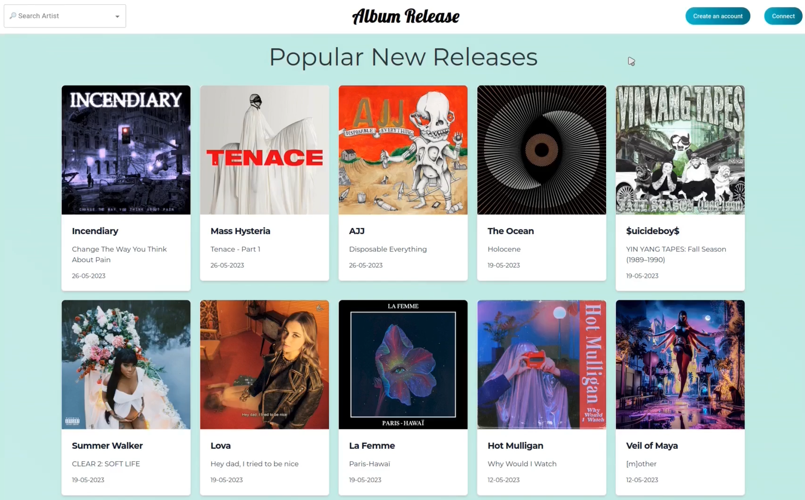

 

  <h1 align="center">Album Release</h1>

  

    A website to track your favorites artists' new releases
     
     
    <a href="https://ar-front.vercel.app">View Demo</a>
  

 

## About The Project

Student project at La Capsule

## Built With

- React.JS
- Node.JS
- Flowbite
- MongoDB
- API Last.fm, MusicBrainz, Fanart.TV, Spotify, Deezer

## License

Distributed under the MIT License. See [LICENSE](https://github.com/pvnkrockjesvs/ar-front/blob/main/LICENSE.md) for more information.

## Authors

* [Guillaume Ronnel](https://github.com/ShaanCoding/)
* [Mohammed Faouzi BenZeghiba]( https://github.com/gitmfb )
* [Robert Nguyen]( https://github.com/Roger-nguyen1)
